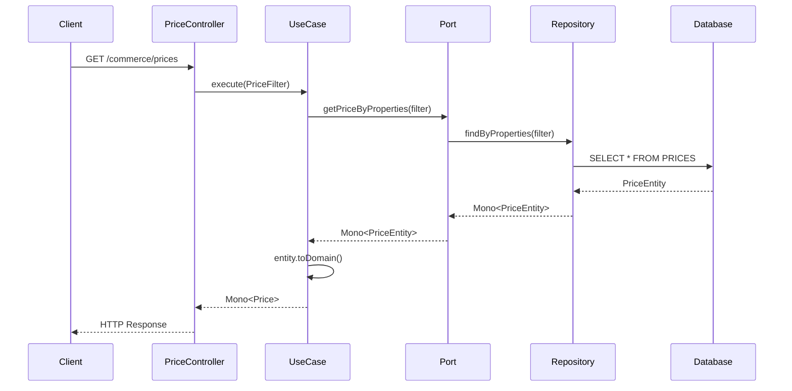

# Commerce API

REST API for price queries based on hexagonal architecture with Spring Boot.

## 📋 Description

This application allows querying product prices by applying filters for brand, product, and application date. It's designed following hexagonal architecture principles (ports & adapters).

## 🏗️ Architecture

### Hexagonal Architecture

```
┌─────────────────────────────────────────────────────────────┐
│                      REST LAYER                             │
│  ┌─────────────────┐  ┌─────────────────┐                  │
│  │   Controller    │  │   Validators    │                  │
│  │(PriceController)│  │(PriceParameter  │                  │
│  └─────────────────┘  │   Validator)    │                  │
│  ┌─────────────────┐  └─────────────────┘                  │
│  │    Adapters     │                                       │
│  │(PriceFilter     │                                       │
│  │   Adapter)      │                                       │
│  └─────────────────┘                                       │
│           │                                                 │
└───────────┼─────────────────────────────────────────────────┘
            │
┌───────────▼─────────────────────────────────────────────────┐
│                     DOMAIN CORE                             │
│  ┌─────────────┐  ┌─────────────┐  ┌─────────────┐         │
│  │   Models    │  │ Use Cases   │  │    Ports    │         │
│  │   (Price,   │  │(Business    │  │ (Inbound &  │         │
│  │ PriceFilter)│  │  Logic)     │  │  Outbound)  │         │
│  └─────────────┘  └─────────────┘  └─────────────┘         │
└───────────┬─────────────────────────────────────────────────┘
            │
┌───────────▼─────────────────────────────────────────────────┐
│                   INFRASTRUCTURE                            │
│  ┌─────────────────┐  ┌─────────────────┐                 │
│  │   Repositories  │  │   Exceptions    │                 │
│  │   (H2 DB +      │  │(PriceNotFound   │                 │
│  │   Persistence)  │  │   Exception)    │                 │
│  └─────────────────┘  └─────────────────┘                 │
└─────────────────────────────────────────────────────────────┘
            ▲
┌───────────┴────────────────────────────────────────────────────────────┐
│                              SHARED DOMAIN                             │
│  ┌─────────────┐  ┌─────────────┐  ┌─────────────┐   ┌─────────────┐   │
│  │   Models    │  │    Ports    │  │Infrastructure│   │    Rest     │   │
│  │ (Message,   │  │ (UseCase,   │  │(GlobalExc.  │   │ (Routing)   │   │
│  │ErrorResponse│  │OutboundPort)│  │  Handler)   │   │             │   │
│  └─────────────┘  └─────────────┘  └─────────────┘   └─────────────┘   │
└────────────────────────────────────────────────────────────────────────┘

```

### Project Structure

```
src/main/java/es/sujes71/api/price/
├── domain/
│   ├── core/                           # Use case implementations
│   │   └── GetPriceByPropertiesUseCaseImpl.java
│   ├── model/                          # Domain models
│   │   ├── Price.java
│   │   └── PriceFilter.java
│   └── ports/
│       ├── inbound/                    # Input ports
│       │   └── GetPriceByPropertiesUseCase.java
│       └── outbound/                   # Output ports
│           └── PricePersistencePort.java
├── infrastructure/
│   ├── exceptions/                     # Infrastructure exceptions
│   │   └── PriceNotFoundException.java
│   └── repository/                     # Persistence implementation
│       ├── PriceRepository.java
│       └── h2/
│           ├── dao/
│           │   └── PriceDao.java
│           └── entity/
│               └── PriceEntity.java
└── rest/
    ├── adapter/                        # REST layer adapters
    │   └── PriceFilterAdapter.java
    ├── validator/                      # Request validation
    │   └── PriceParameterValidator.java
    └── PriceController.java           # Controller está fuera de adapter

src/main/java/es/sujes71/shared/
├── domain/
│   ├── model/
│   │   ├── Message.java                # Event messaging
│   │   └── ErrorResponse.java          # Keep error response model
│   └── ports/
│       ├── inbound/
│       │   └── UseCase.java
│       └── outbound/
│           └── OutboundPort.java       # Event system
└── infrastructure/
|    └── exceptions/
│       └── outbound/
│       └── GlobalExceptionHandler.java
└── Rest
    └── Routing.java
```

## 🚀 Technologies Used

- **Java 17+**
- **Spring Boot 3.x**
- **H2 Database** - In-memory database
- **JUnit 5** - Testing
- **Mockito** - Mocking for tests
- **Lombok** - Boilerplate reduction
- **Maven** - Dependency management

## 📊 Data Model

### Price Entity
```sql
CREATE TABLE PRICES (
    ID LONG PRIMARY KEY,
    BRAND_ID INT NOT NULL,
    PRODUCT_ID INT NOT NULL,
    PRICE_LIST INT NOT NULL,
    START_DATE TIMESTAMP NOT NULL,
    END_DATE TIMESTAMP NOT NULL,
    PRIORITY INT NOT NULL,
    PRICE DECIMAL(10,2) NOT NULL,
    CURRENCY VARCHAR(3) NOT NULL
);
```

### Domain Model
```java
// Price Filter (Input)
{
    "brandId": 1,
    "productId": 35455,
    "applicationDate": "2020-06-14T10:00:00"
}

// Price Response (Output)
{
	"brandId": 1,
	"startDate": "2020-06-15T00:00:00",
	"endDate": "2020-06-15T11:00:00",
	"productId": 35455,
	"priority": 1,
	"price": 30.50,
	"currency": "EUR",
	"priceList": 3
}
```

## 🔧 Setup and Execution

### Prerequisites
- Java 17 or higher
- Maven 3.6+

### Installation
```bash
# Clone the repository
git clone <repository-url>
cd Commerce

# Compile the project
mvn clean compile

# Run tests
mvn test

# Run the application
mvn -pl service spring-boot:run
```

### Database
The application uses H2 in-memory database that initializes automatically with test data.

**H2 Console:** http://localhost:8080/h2-console
- **JDBC URL:** `jdbc:h2:mem:testdb`
- **Username:** `sa`
- **Password:** *(empty)*

## 📡 API Endpoints

### Query Price
```http
GET /commerce/prices?brandId={brandId}&productId={productId}&applicationDate={date}
```

**Parameters:**
- `brandId` (Integer): Brand ID
- `productId` (Integer): Product ID  
- `applicationDate` (String): Date in ISO format (yyyy-MM-ddTHH:mm:ss)

**Request Example:**
```http
GET /commerce/prices?brandId=1&productId=35455&applicationDate=2020-06-14T10:00:00
```

**Response Example:**
```json
{
	"brandId": 1,
	"startDate": "2020-06-15T00:00:00",
	"endDate": "2020-06-15T11:00:00",
	"productId": 35455,
	"priority": 1,
	"price": 30.50,
	"currency": "EUR",
	"priceList": 3
}
```

**Response Codes:**
- `200 OK` - Price found
- `404 NOT FOUND` - Price not found
- `400 BAD REQUEST` - Invalid parameters
- `500 INTERNAL SERVER ERROR` - Server error

## 🧪 Testing

### Run Tests
```bash
# All tests
mvn test

# Specific tests
mvn test -Dtest=PriceRepositoryTest
mvn test -Dtest=GetPriceByPropertiesUseCaseImplTest
mvn test -Dtest=PricePersistencePortTest
```

### Test Coverage
- **Use Cases:** 100% - Business logic
- **Repositories:** 100% - Data persistence
- **Ports:** 100% - Communication between layers
- **REST Adapters:** 100% - REST endpoints

### Implemented Test Cases
- ✅ Successful price query
- ✅ Price not found
- ✅ Database error handling
- ✅ Null parameter validation
- ✅ Exception propagation
- ✅ Entity to domain mapping

## 🔄 Data Flow



## 🎯 Technical Features

### Event System
- **OutboundPort:** Handler registration and resolution system
- **Event Bus:** Decoupled communication between layers
- **Message:** Wrapper for event communication

### Hexagonal Architecture
- **Input Ports:** Interfaces for use cases
- **Output Ports:** Interfaces for persistence
- **REST Adapters:** HTTP interface implementations
- **Repository Adapters:** Database persistence implementations

## 📈 Future Improvements

- [ ] Implement caching with Redis
- [ ] Add metrics with Micrometer
- [ ] Documentation with OpenAPI/Swagger
- [ ] Advanced validation with Bean Validation
- [ ] Health checks and actuators
- [ ] Containerization with Docker
- [ ] CI/CD pipeline
- [ ] Structured logging
- [ ] Rate limiting
- [ ] Circuit breaker pattern

## 👥 Contributing

1. Fork the project
2. Create feature branch (`git checkout -b feature/new-feature`)
3. Commit changes (`git commit -am 'Add new feature'`)
4. Push to branch (`git push origin feature/new-feature`)
5. Create Pull Request

## 📄 License

This project is licensed under the MIT License - see the [LICENSE](LICENSE) file for details.

---

**Developed by:** sujes71  
**Version:** 1.0.0  
**Last updated:** June 2025
